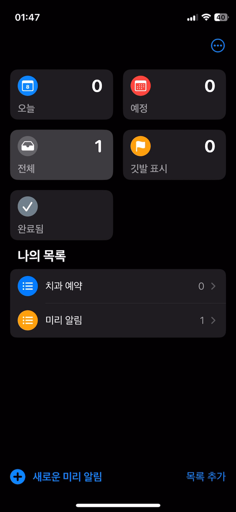
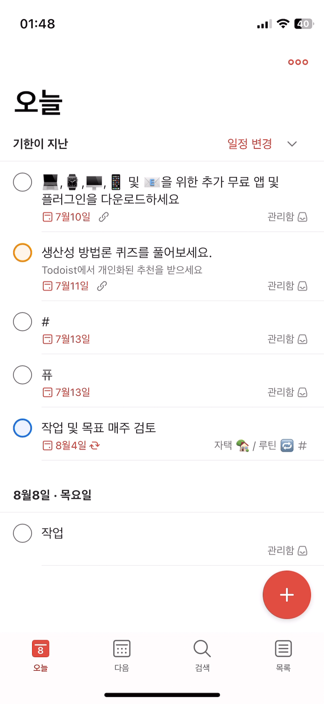

# 📍 WhatToDoHere

 

  

 

WhatToDoHere는 <b>위치 기반 미리 알림</b>을 제공하는 React Native 모바일 애플리케이션입니다.  
사용자의 GPS와 WiFi 정보를 활용하여 특정 위치에 등록된 할 일을 알려주며,  
친구와의 할 일 공유 기능을 통해 협업을 지원합니다.

 

# 🔗 Links

 <a href="#-links">WhatToDoHere iOS</a> | <a href="#-links">WhatToDoHere TestFlight</a> | <a href="https://github.com/moonstrnck/WhatToDoHere">WhatToDoHere Repository</a>

 

# 🗂️ Index

- [**📍 WhatToDoHere**](#-whattodohere)
- [**🔗 Links**](#-links)
- [**🧐 Motivation**](#-motivation)
- [**🔧 Tech Stack**](#-tech-stack)
- [**📱 Features**](#-features)
- [**🚨 Challenges**](#-challenges)
- [**💭 Reflections**](#-reflections)

 

# 🧐 Motivation

우리에겐 매 순간 크고 작은 할 일들이 생겨납니다. 타임라인 순으로 처리할 일도 있지만, 특정 위치에서만 할 수 있는 일들이 있습니다. 예를 들어, 세탁기 예약 설정과 같이 집에서만 할 수 있는 일, 또는 회사에서 해야 할 업무처럼요. 
시중에는 수많은 작업 관리 툴들이 많지만 오히려 너무 많은 옵션과 기능을 제공해 간편한 작업들을 등록하기에 부담스러운 경우가 많습니다. 그래서 저는 보다 직관적으로 위치 별 할 일을 등록하여 해당 위치에 도착했을 때 알려주는 애플리케이션이 있으면 일상의 편리함을 줄 수 있지 않을까? 라는 아이디어에서 WhatToDoHere를 기획하게 되었습니다.

 

# 🔧 Tech Stack

### Client

![Jotai](https://img.shields.io/badge/Jotai-white.svg?logo=data:image/svg+xml;base64,PHN2ZyB4bWxucz0iaHR0cDovL3d3dy53My5vcmcvMjAwMC9zdmciIHdpZHRoPSIyLjllbSIgaGVpZ2h0PSIxZW0iIHZpZXdCb3g9IjAgMCA1MTIgMTc3Ij48cGF0aCBkPSJNNzQuOTk3IDkuNDA1aDM0LjQ1M3YxMTQuOTJhNTIuMTYgNTIuMTYgMCAwIDEtNy4wODIgMjcuNjM3YTQ4LjE0IDQ4LjE0IDAgMCAxLTE5Ljc5NCAxOC4xMTJhNjQuMiA2NC4yIDAgMCAxLTI5LjM3MiA2LjM5MmE2Ni41IDY2LjUgMCAwIDEtMjctNS4zMTJhNDMgNDMgMCAwIDEtMTkuMTItMTYuMDkzUTAgMTQ0LjI3OSAwIDEyNy44NjZoMzQuNjgzYy4xMDcgNi41MzMgMiAxMS42MzIgNS42ODMgMTUuMjQ0YTE5Ljg1IDE5Ljg1IDAgMCAwIDE0LjYwNyA1LjQzNXExOS44NjQgMCAyMC4wMjQtMjQuMjJ6bTExMC45MDEgMTY3LjIycS0xOC43NSAwLTMyLjM4MS04LjAwM2E1NC4wNyA1NC4wNyAwIDAgMS0yMS4wNTEtMjIuMzc4YTcxLjc0IDcxLjc0IDAgMCAxLTcuNC0zMy4zNTZhNzIuMTUgNzIuMTUgMCAwIDEgNy40LTMzLjUxNWE1NC4yIDU0LjIgMCAwIDEgMjEuMDUtMjIuMzc4YTYyLjkgNjIuOSAwIDAgMSAzMi4zODItOC4wMDNhNjMgNjMgMCAwIDEgMzIuNCA4LjAwM2E1NC4xIDU0LjEgMCAwIDEgMjEuMDMzIDIyLjM3OGE3Mi4xNiA3Mi4xNiAwIDAgMSA3LjQxOCAzMy41MTVhNzEuNzQgNzEuNzQgMCAwIDEtNy40MTggMzMuMzU2YTU0IDU0IDAgMCAxLTIxLjAzMyAyMi4zNzhxLTEzLjY1IDguMDItMzIuNCA4LjAwM20zOS4xOTgtMTY3LjIydjE4LjU5aC03OC4zNzhWOS40MDV6bS0zOC45NSAxNDAuNjYzYTIxLjI1IDIxLjI1IDAgMCAwIDE4Ljk4NS0xMC4xMjZsLjI5Ni0uNDk3cTYuNTUtMTAuNjIyIDYuNTUtMjYuNzg3cTAtMTUuNjI1LTYuMTctMjYuMTIybC0uNDM0LS43MThhMjEuMjUgMjEuMjUgMCAwIDAtMTkuMjgtMTAuNjIzYTIxLjUxIDIxLjUxIDAgMCAwLTE5LjE4MiAxMC4xMzdsLS4yOTMuNDg2cS02LjYwNCAxMC42MjMtNi42MDQgMjYuODRxMCAxNS42NzYgNi4xNzEgMjYuMDc2bC40MzMuNzExYTIxLjUzIDIxLjUzIDAgMCAwIDE4Ljg2IDEwLjYzOXptMTQzLjY5LTk5LjQ2NHYyNS43NmgtMjMuMjYzdjU5Ljk0N3EwIDcuMDgzIDMuMjIyIDkuNTYxYTEzLjI4IDEzLjI4IDAgMCAwIDcuODE0IDIuNTFsLjU2LS4wMTRhMjYgMjYgMCAwIDAgNC44MTYtLjQ0MmwzLjctLjY3M2w1LjMxMiAyNS41MTJsLTEuMzIyLjM4NWMtMS41NzYuNDQ0LTMuNTIzLjk0Ny01LjkyIDEuNDkyYTYwLjQgNjAuNCAwIDAgMS0xMC4wNzcgMS4yODdsLTEuMjcxLjA0cS0xOC42NzkuODMzLTI5Ljk3NC04LjA3MnEtMTEuMDQtOC43MDQtMTEuMTM4LTI2LjMzNGwuMDAyLTY1LjJoLTE2LjkwOHYtMjUuNzZoMTYuOTA4di0yOS42MmgzNC4yNzZ2MjkuNjJ6bTUyLjU4MyAxMjUuOTVxLTE3LjcwNCAwLTI5LjM3Mi05LjI2dC0xMS42NjctMjcuNnEwLTEzLjgyOSA2LjUxNS0yMS43MjRhMzcuNSAzNy41IDAgMCAxIDE3LjEwMy0xMS41NjJhOTcgOTcgMCAwIDEgMjIuNzMzLTQuNzhhMTc0LjUgMTc0LjUgMCAwIDAgMjMuMDE2LTMuMzgxcTYuOTQtMS43NyA2LjkyMi03Ljcydi0uNDk1Yy4yNi00LjQ2LTEuNDk1LTguOC00Ljc4LTExLjgyN3EtNC44MTUtNC4xNi0xMy41NjItNC4xNzhhMjQuMzggMjQuMzggMCAwIDAtMTQuNzMgNC4wMTlhMTguOTQgMTguOTQgMCAwIDAtNy4yNDEgMTAuMjE1bC0zMS43MDktMi41NjdhNDIuMjggNDIuMjggMCAwIDEgMTcuNTgtMjYuODA1cTE0LjA1OC05Ljg3OSAzNi4yNi05Ljg5N2E3NC44IDc0LjggMCAwIDEgMjUuNzQyIDQuMzU2YTQyLjgzIDQyLjgzIDAgMCAxIDE5LjM2OSAxMy41NjFxNy4zNjUgOS4yMjUgNy4zNjUgMjMuOTM3djgzLjM3MWgtMzIuNTA2di0xNy4xMzhoLS45NTZhMzUuNzMgMzUuNzMgMCAwIDEtMTMuNDkgMTQuMDRxLTguOTc3IDUuNDM1LTIyLjU5MiA1LjQzNW05LjgwOS0yMy42NzFhMjYuNTYgMjYuNTYgMCAwIDAgMTguNTE5LTYuNTVhMjEuMTQgMjEuMTQgMCAwIDAgNy4yNDItMTUuNjY3bC0uMDAxLTEzLjc0MWEyMC4yIDIwLjIgMCAwIDEtNi4yMzIgMi40MDhhMTAxIDEwMSAwIDAgMS05LjAzIDEuNzdsLTMuMDgzLjQ3NGMtMS45NzYuMzExLTMuNzk4LjYwNi01LjQ4NS44NTRhMzQgMzQgMCAwIDAtMTQuNTE4IDUuMDgxYTEyLjUgMTIuNSAwIDAgMC01LjUwNiAxMS4wMTNhMTIuMjkgMTIuMjkgMCAwIDAgNS4wOTkgMTAuNjIyYTIyIDIyIDAgMCAwIDEyLjI1MyAzLjc0NnptMTAxLjc5LTExOC4yMTJsLS42MDgtLjAwMmExOC40MyAxOC40MyAwIDAgMS0xMy4wNDktNS4xMTZhMTYuMTggMTYuMTggMCAwIDEtNS40Ny0xMi4yN2ExNi4xIDE2LjEgMCAwIDEgNS40Ny0xMi4yMzNjNy40MjQtNi43MzMgMTguNzQ0LTYuNzMzIDI2LjE2OCAwYTE2LjEgMTYuMSAwIDAgMSA1LjQ3IDEyLjIzM2ExNi4xOCAxNi4xOCAwIDAgMS01LjA1NiAxMS44OWwtLjQxNC4zOGExOC41IDE4LjUgMCAwIDEtMTIuNTEgNS4xMThtLTE3Ljc2NCAxMzkuNTQ2VjUwLjYwNGgzNC4yNzZ2MTIzLjYxM3oiLz48L3N2Zz4=&style=for-the-badge&logoColor=black)

### Server

### Test

### Deployment

### Development Tools

## ✔️ 네이티브 모듈을 사용함에도 왜 Expo였나?

Expo는 React Native 개발을 단순화하는 프레임워크입니다. 이는 복잡한 네이티브 환경 설정 없이 iOS와 Android 앱을 개발할 수 있게 해줍니다. Expo SDK는 이 프레임워크의 핵심 구성 요소로, 다양한 네이티브 기능을 JavaScript API로 제공합니다. 이를 통해 개발자는 네이티브 코드를 직접 작성하지 않고도 많은 기능을 구현할 수 있습니다.   
이러한 이유로 초기 계획부터 Expo를 활용한 React Native 개발을 진행하려고 했습니다. 또한 위치 추적(expo-location)과 알림 기능(expo-notifications)은 위치 기반 할 일 알림이라는 WhatToDoHere 앱의 핵심 기능 구현에 필수적이었습니다. 이를 Expo SDK가 지원해주기에 Expo를 통해 구현해야겠다는 생각이었습니다.   
그러나 프로젝트 진행 중 Expo SDK가 지원하는 모듈 이외의 네이티브 모듈 또한 필요한 상황이라는 것을 얼마 지나지 않아 깨닫게 되었습니다. WhatToDoHere에서는 정밀한 지도 기능을 위한 `react-native-maps`와 WiFi 네트워크 정보 확인을 위한 `@react-native-community/netinfo`가 필요했습니다. Expo SDK에서 지원하지 않는다는 모듈임을 확인한 후에는 Expo를 포기해야한다는 생각에 절망적이었습니다.  
하지만 결론적으로 이 문제는 EAS(Expo Application Services) Prebuild를 통해 해결할 수 있었습니다. EAS Prebuild 도입 이전에는 네이티브 모듈을 사용하기 위해 `expo eject` 명령을 사용해야 했습니다. Expo 환경에서 벗어나 순수 React Native 프로젝트를 전환하는 것을 의미했고, 이는 Expo의 많은 이점을 포기해야 하는 단점이 있었죠. 하지만 EAS Prebuild는 Expo의 편의성을 유지하면서도 추가적인 네이티브 모듈을 사용할 수 있게 해주는 도구입니다.   
결과적으로, Expo와 EAS Prebuild의 조합은 WhatToDoHere 프로젝트에 적합했습니다. 위치 기반 서비스, 알림 시스템, 지도 통합, 네트워크 상태 관리 등의 복잡한 기능을 효율적으로 구현할 수 있었고, 동시에 필요한 모든 네이티브 기능도 사용할 수 있었습니다. 이로 인해 개발 시간이 단축되고 실제 기능 개발에 더욱 집중할 수 있었습니다.

## ✔️ 상태관리 도구로서 Jotai를 선택한 이유

짧은 개발 기간과 프로젝트 규모를 생각했을 떄, 상태관리 도구로서 Jotai를 선택했습니다. 가장 크게 고려했던 점은 작은 기능에도 잦은 화면 전환이 일어날 수 있는 모바일 앱 특성상, 다양한 화면 또는 컴포넌트에서 전역상태에 쉽게 접근이 가능했어야 했습니다. Jotai는 이런 상황에서 매우 적합했습니다. Jotai는 atom이라는 작은 단위로 상태를 관리합니다.   이 atom들은 필요한 컴포넌트에서 쉽게 임포트하여 사용할 수 있습니다. 이는 중앙 집중식 store를 사용하는 다른 상태 관리 라이브러리와는 달리 전역 상태에 쉽게 접근하고 업데이트 할 수 있는 환경을 제공합니다.  
또한 Jotai는 atom 단위로 상태가 업데이트되므로 불필요한 리렌더링을 줄일 수 있었습니다.  
다양한 상태관리 도구와 비교했을 때에도 Jotai의 Atomic 접근 방식이 더욱 세분화되고 유연한 방식으로 상태를 업데이트할 수 있다는 점에서 가장 매력적으로 다가왔기 때문에 Jotai를 상태관리 도구로서 선택하게 되었습니다. 다음은 다른 전역상태관리 도구와 Jotai를 비교한 표입니다.

<table style="border-collapse: collapse; width: 100%;">
  <thead>
    <tr style="background-color: #eee;">
      <th align="left" style="border: 1px solid #ddd; text-align: left; width: 15%;">라이브러리</th>
      <th align="left" style="border: 1px solid #ddd; text-align: left; width: 25%;">장점</th>
      <th align="left" style="border: 1px solid #ddd; text-align: left; width: 25%;">단점</th>
      <th align="left" style="border: 1px solid #ddd; text-align: left; width: 35%;">프로젝트 적합성</th>
    </tr>
  </thead>
  <tbody>
    <tr>
      <td style="border: 1px solid #ddd; width: 15%;">Redux</td>
      <td style="border: 1px solid #ddd; width: 25%;">
        • 강력하고 예측 가능한 상태 관리 
        • 큰 생태계
      </td>
      <td style="border: 1px solid #ddd; width: 25%;">
        • 복잡한 설정 
        • 많은 보일러플레이트 코드 필요
      </td>
      <td style="border: 1px solid #ddd; width: 35%;">프로젝트의 규모가 Redux의 복잡성을 정당화할 만큼 크지 않음</td>
    </tr>
    <tr>
      <td style="border: 1px solid #ddd; width: 15%;">MobX</td>
      <td style="border: 1px solid #ddd; width: 25%;">
        • 반응형 프로그래밍 모델 
        • 강력한 성능
      </td>
      <td style="border: 1px solid #ddd; width: 25%;">
        • 학습 곡선이 가파름 
        • 내부 동작이 복잡하여 디버깅이 어려울 수 있음
      </td>
      <td style="border: 1px solid #ddd; width: 35%;">앱의 상태 모델이 MobX의 복잡성을 필요로 하지 않음</td>
    </tr>
    <tr>
      <td style="border: 1px solid #ddd; width: 15%;">Recoil</td>
      <td style="border: 1px solid #ddd; width: 25%;">
        • React에 특화 
        • 강력한 비동기 지원
      </td>
      <td style="border: 1px solid #ddd; width: 25%;">
        • 업데이트 주기가 불규칙적 
        • 커뮤니티 활성도가 상대적으로 낮음
      </td>
      <td style="border: 1px solid #ddd; width: 35%;">기능은 유사하지만, Jotai에 비해 안정성과 커뮤니티 지원이 부족</td>
    </tr>
    <tr>
      <td style="border: 1px solid #ddd; width: 15%;">Zustand</td>
      <td style="border: 1px solid #ddd; width: 25%;">
        • 간단한 API 
        • 작은 번들 사이즈
      </td>
      <td style="border: 1px solid #ddd; width: 25%;">• Redux와 유사한 패턴을 따르므로 약간의 보일러플레이트 필요</td>
      <td style="border: 1px solid #ddd; width: 35%;">Jotai보다 약간 더 복잡하고, React에 덜 특화됨</td>
    </tr>
    <tr>
      <td style="border: 1px solid #ddd; width: 15%;">Jotai</td>
      <td style="border: 1px solid #ddd; width: 25%;">
        • 매우 간단한 API 
        • React Hooks와의 완벽한 통합 
        • 필요한 컴포넌트만 리렌더링 
        • 작은 번들 사이즈
      </td>
      <td style="border: 1px solid #ddd; width: 25%;">• 복잡한 상태 로직에는 부족할 수 있음</td>
      <td style="border: 1px solid #ddd; width: 35%;">
        • 간단한 API로 빠른 개발 가능 
        • 작은 번들 사이즈로 모바일 앱 성능 최적화 
        • React Native와의 호환성이 뛰어남 
        • Firebase와의 비동기 작업 처리에 적합
      </td>
    </tr>
  </tbody>
</table>
 

# 📱 Features

## 1. 구글 로그인 및 로그아웃

[시연 영상 첨부 예정]

<!-- 

  

  -->

- 간편한 로그인을 위한 구글 연동 로그인 및 로그아웃
  - 친구와의 할 일 공유 기능을 위해서는 로그인 정보 필수
  - Guest 모드 (기능 보완 예정, 로그인하지 않아도 친구 공유 기능 이외에 사용이 가능해야함)

## 2. 위치 및 할 일 관리

<!--

  

  -->

[시연 영상 첨부 예정]

- 현재 위치 또는 위치 검색을 통한 새로운 위치 등록
- (현재 위치의 경우) WiFi SSID 및 BSSID 정보 자동 등록
- 위치별 공개/비공개 설정
- 할 일 제목, 메모, 이미지 등록 기능
- 할 일별 알림 여부, 도착할 때/떠날 때 옵션 설정, 지연 알림 시간 설정
- 사용자가 등록한 위치에 도착하거나 떠날 때 알림 제공

## 3. 친구와의 할 일 공유

<!-- 

  

  -->

[시연 영상 첨부 예정]

- 이메일을 통한 친구 검색 및 등록
- 친구의 공개 위치 확인 및 할 일 요청 기능

## 4. 사용자 경험

<!-- 

  

  -->

[시연 영상 첨부 예정]

- 완료한 할 일 목록 제공
- 직관적인 사용자 인터페이스
  - 위치별 할 일 목록 표시 및 위치 카드의 아코디언 UI
  - Native-like interactions

 

# 🚨 Challenges

약 3주라는 기간 동안 기획, 디자인, 개발까지 하나의 애플리케이션을 만들기 위한 전체적인 개발 프로세스를 혼자 겪으며 부딪혔던 난관들은 주제가 참 다양했습니다. 사용성 측면에서 메인화면부터 어떻게 구성해야할까 하는 고민이 먼저 있었고, 핵심 기능의 완성도를 위해 계속해서 기능의 옵션이나 기능 자체가 추가되는 경험도 하였습니다. 크고 작은 챌린지들이 있었지만 프로젝트의 완성도에 크게 기여한 챌린지를 3가지로 추려보았습니다.

## 1. 메인화면에 앱의 핵심 기능을 어떻게 잘 보여줄 수 있을까?: 사용성을 위한 고민들

WhatToDoHere의 핵심적인 아이덴티티는 수많은 작업 관리 애플리케이션 중에서도 **위치 기반으로 작업을 관리**한다는 점입니다. 작업 관리 애플리케이션은 이미 시중에 많은 서비스가 있지만 차별점을 갖기위해서는 선택과 집중이 필요했습니다.  사전 조사 차원에서 주변 지인들에게 작업 관리 애플리케이션 사용 현황이나 의견 등을 물어보았습니다. 예상대로 날짜별 일정관리 어플은 많이 사용하지만, 기능이 매우 고도화된 작업 관리 애플리케이션의 경우, 오히려 너무 많은 기능을 제공하면서 UI가 비교적 직관적이지 못하다던가, 사용자의 학습량이 늘어나게 되어 접근성이 떨어진다는 피드백을 받을 수 있었습니다.   
여기서 얻을 수 있었던 힌트는 위치 기반 작업 관리라는 컨셉에 맞춰 특별한 학습없이 사용할 수 있도록 단순하고 직관적인 UI를 제공하자는 것이었습니다.

### 1-1. 작업 관리 애플리케이션을 벤치마킹하자!

  <table>
    <tr>
      <td align="center"></td>
      <td align="center"></td>
    </tr>
    <tr>
      <td align="center" style="font-size: 12px; color: #ccc;">iOS 미리알림</td>
      <td align="center" style="font-size: 12px; color: #ccc;">Todoist</td>
    </tr>
  </table>

 

iOS 미리 알림은 작업 알림에 대한 다양한 옵션을 제공하는 대표적인 Reminder 애플리케이션입니다.  날짜/시간/태그/위치 등을 알림에 설정할 수 있으나 개인적으로는 사용자가 단번에 이러한 기능을 모두 파악하기에는 어려움이 있다고 생각됐습니다.  그 이유가 무엇일까 생각했을 때, 미리 알림의 메인 화면이 폴더로 구성되어 있어 제공하는 정보가 극히 적고, 폴더에 태그나 위치정보를 등록할 수 있음에도 직접 설정해보지 않으면 알 수가 없었습니다. 반면, 인상깊었던 UI는 새로운 미리 알림을 등록하는 모달로 이동할 때 특유의 네이티브 인터랙션이 자연스러워 이런 점은 제 애플리케이션에도 적용하면 좋겠다고 생각했습니다.
  
Todoist는 메인 화면에서 타임라인 형식으로 작업 목록을 보여주고 있었습니다.  체크 리스트 형태여서 사용자가 즉시 완료 처리를 할 수 있다는 점이 간편해 보였고, 토글 기능을 이용해 목록을 접었다 펼칠 수 있는 기능이 사소하지만 편의를 제공한다고 느껴졌습니다.

### 1-2. UX/UI 개선의 과정과 실제 구현된 메인 화면

  

   
  <i>WhatToDoHere 메인</i>

 

결론적으로, 저는 메인 화면에 카드 형태로 위치 정보를 강조하도록 메인화면을 구성하였습니다. 또한 작업 목록을 위치 카드에 함께 보여주되 토글 버튼을 추가하여 카드를 접었다 펼칠 수 있도록 하였습니다.  이는 작업 목록이 많아질 경우 카드의 높이가 높아져 스크롤이 길어지는 것을 방지하고, 위치 정보만을 명료하게 보여주기 위함이었습니다.  
이처럼 위치 카드가 작업 추가/수정, 위치 수정 기능까지 핵심 기능을 대부분 포함하고 있지만 사용자가 기능을 단번에 알아볼 수 있도록 직관적인 UI를 지향했고,   **expo-router**를 이용해 stack navigation을 구현함으로써 사용자에게 보다 부드러운 화면 전환을 제공할 수 있었습니다.

## 2. 다양한 옵션을 처리하는 할 일별 알림 로직 구현

`WhatToDoHere` 서비스는 결국 사용자에게 작업 알림을 제공하는 것이 근본적인 목표입니다. 따라서 알림 기능을 정교하게 구현하는 것은 매우 중요했습니다.    초기 기획단계에서 생각한 알림 기능은 GPS정보 활용만을 전제로 하고 있었습니다. 하지만 GPS만으로는 제가 목표로하는 위치 정확도를 구현하기에 한계가 있었습니다. 제가 생각한 아이디어는 우리가 이전에 방문했던 위치를 다시 방문했다는 사실의 근거가 될 수 있는 정보는 **이전에 접속했던 네트워크에 다시 접속한 사실이 될 수 있지 않을까?** 였습니다.   
그래서 제가 기획 단계에 정의한 알림 기능은 다음과 같습니다.

1. 현재 위치 등록시 위치 정보와 (접속한 WiFi 정보가 있다면)WiFi 정보도 함께 저장
2. 이후 해당 위치의 위치값과 현재 위치값이 일치하거나, 현재 네트워크 정보가 저장된 WiFi 정보와 일치한다면 푸시 알림

GPS와 WiFi 정보를 조합하여 알림 기능을 구현하자는 목표 하에 위치 추적 기능을 구체화해보았습니다.

### 2-1. 위치 기반 애플리케이션의 핵심 과제: 배터리 효율성과 Geofencing

실시간 위치 기반 애플리케이션은 당연하게도 백그라운드 위치 추적이 불가피합니다. 처음에는 사용자의 현재 위치 정보를 사용하기 위해 일정 시간 간격으로 위치를 확인하고자 했습니다. 하지만 이러한 지속적인 위치 정보 수집은 배터리를 빨리 소모시킨다는 **치명적인 문제**가 있었습니다.   이를 해결하기 위해 접하게 된 개념이 바로 Geofencing입니다. Geofencing은 위치 기반 애플리케이션에서 배터리 효율을 위해 이미 널리 채택되고 있는 기술이었습니다.

#### 📍 Geofencing

   
  <i>Geofencing 예시</i>

  

Geofencing은 가상의 지리적 경계를 설정하고, 사용자가 이 경계를 출입할 때만 이벤트를 트리거하는 위치 기반 기술입니다. 이 접근 방식은 다음과 같은 이유로 배터리 최적화에 탁월합니다.
  

- 선택적 모니터링: 지속적인 GPS 추적 대신, 관심 지역 주변에서만 활성화
- 시스템 레벨 최적화: 운영 체제에 내장되어 있어, 리소스 사용을 효율적으로 관리
- 이벤트 기반 처리: 특정 지역 진입/이탈 시에만 앱을 활성화하여 불필요한 백그라운드 처리를 줄임.

 

이러한 이유로 WhatToDoHere에서는 백그라운드 위치 추적에 있어 Geofencing 개념을 도입하기로 결정하였고, 이는 Expo SDK가 지원하는 `expo-loation` 라이브러리를 이용하여 비교적 간편한 API를 통해 구현할 수 있었습니다.

### 2-2. Geofencing으로 알림을 처리하기는 하는데, WiFi정보와 어떻게 결합해서 위치의 정확성을 구현할까?

호기롭게 Geofencing 을 이용하여 테스트 알림까지 구현 한 후에 문득 떠오른 생각은 **WiFi 정보를 어떻게 결합해서 알림을 보내지?** 였습니다.   
초기 기획에서는 할 일별 알림 설정에 대한 옵션을 **특정 위치에 도착/출발** 옵션만 제공하는 방향으로 단순하게 가져갔었는데요.  
WhatToDoHere의 차별성과 사용성을 생각했을 때, 처음 추가된 옵션이 **WiFi**였고,  
이후 **사용자가 특정 위치에 도착 후에 반드시 바로 알림을 받고 싶지 않을 수 있다** 라는 피드백을 받고, 지연 시간을 설정할 수 있는 옵션까지 추가하게 되었습니다. 
그렇다면 이제 사용자에게 할 일에 대한 푸시 알림을 제공할 때 고려해야할 사항은 다음과 같습니다.

- 특정 위치
- 도착할 때/떠날 때
- 등록된 위치에 WiFi 정보가 있다면 현 위치의 WiFi 정보
- 알림 지연 시간

 

여기서 제가 WiFi 옵션을 넣으면서 [처음에 구상했던 알림 로직 (알림 기능 2)](#2-다양한-옵션을-처리하는-할-일별-알림-로직-구현) 에 오류가 있음을 발견했습니다.   
GPS와 WiFi 정보가 둘 중 하나라도 일치하면 알림을 제공한다는 것은 위치 정확성과 거리가 멉니다. 또한 조건이 포괄적이어서 알림 로직을 구현함에 있어서도 둘 중 하나의 정보를 체크해야한다면 반드시 두 가지 정보를 모두 확인해야하므로 성능적으로도 좋지 않다는 판단을 했습니다.  실제 위치 정보의 정확성을 확보하려면 Geofencing과 더불어 WiFi 값까지 정확히 일치해야할 것입니다.   하지만 위치 마다 WiFi 정보가 존재하지 않을 수 있고(사용자가 등록하지 않은 경우), 사용자가 포괄적인 범위에서 알림을 받고 싶을 수도 있습니다.  
이런 경우 최선의 결정은 사용자에게 옵션을 주는 것이 적합하다고 판단하여, 기능을 추가하게 되었습니다. (실제 기능 추가해야함)

#### 사용자에게 옵션을 제공하자!

### 2-3. 같은 알림이 반복해서 울린다?

## 3. 로컬에서 사용하던 유저가 로그인을 하면?

배포 관련 챌린지들 (reject 사항 구현)

- 기능 추가해야할 것들
- 로그인 하지 않고 접근가능한 기능들 구현 (Guest 모드 구현)
- Guset로 이용하던 유저가 로그인을 하게 되면 AsyncStorage에 있는 정보를 FireStore(DB)으로 어떻게 이관하면 될까?

 

# 💭 Reflections

[회고 작성 예정]
